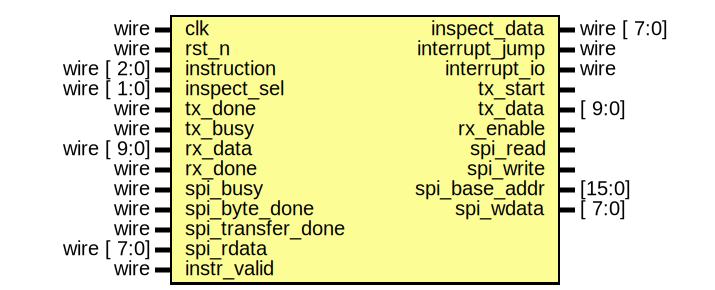

# Entity: bf_asic
- **File**: bf_asic.v

## Diagram

## Overview
Brainfuck ASIC core with 1-cycle instruction execution, 9-byte data cache, interrupt-driven bracket handling via RX/TX, support for up to 8 nested loops, SPI RAM interface.

## Ports

| Port name         | Direction | Type        | Description |
| ----------------- | --------- | ----------- | ----------- |
| clk               | input     | wire        | System clock |
| rst_n             | input     | wire        | Active-low reset |
| instruction       | input     | wire [2:0]  | 3-bit BF instruction |
| instr_valid       | input     | wire        | Pulse HIGH to execute instruction |
| inspect_data      | output    | wire [7:0]  | Internal state readback |
| inspect_sel       | input     | wire [1:0]  | Select: data(00), ptr(01), pc(10), bstack(11) |
| interrupt_jump    | output    | wire        | MCU must handle bracket jump |
| interrupt_io      | output    | wire        | MCU must handle I/O operation |
| tx_done           | input     | wire        | Serial TX complete |
| tx_busy           | input     | wire        | Serial TX busy |
| tx_start          | output    | reg         | Start serial TX |
| tx_data           | output    | reg [9:0]   | Serial TX 10-bit data (PC or data with padding) |
| rx_done           | input     | wire        | Serial RX complete |
| rx_data           | input     | wire [9:0]  | Serial RX 10-bit data (PC or data with padding) |
| rx_enable         | output    | reg         | Enable serial RX |
| spi_read          | output    | reg         | Start SPI read (5 bytes) |
| spi_write         | output    | reg         | Start SPI write (5 bytes) |
| spi_busy          | input     | wire        | SPI transfer in progress |
| spi_byte_done     | input     | wire        | SPI byte complete |
| spi_transfer_done | input     | wire        | SPI transfer complete |
| spi_base_addr     | output    | reg [15:0]  | SPI starting address |
| spi_wdata         | output    | reg [7:0]   | SPI write data |
| spi_rdata         | input     | wire [7:0]  | SPI read data |

## State Machine
- **STATE_EXEC**: Execute instructions
- **STATE_SPI_WRITE**: Write cache to SPI RAM
- **STATE_SPI_FETCH**: Read cache from SPI RAM
- **STATE_WAIT_JUMP**: Wait for MCU jump handling
- **STATE_WAIT_IO**: Wait for MCU I/O handling

## Features
- 9-byte data tape cache (4 left + center + 4 right)
- 8-deep bracket stack (10-bit PC values)
- Automatic cache window management
- 2 Serial interfaces (10-bit RX/TX), 1 SPI Master interface

## Conditional Handling
The design uses interrupt flags to complete bracket operations with the MCU:

### `[` (OPEN bracket)
- **If data = 0**: Trigger `interrupt_jump`, save instruction, enable RX. MCU sends PC of matching `]` via serial RX. ASIC jumps to that PC.
- **If data ≠ 0**: Push current PC to bstack, continue execution (enter loop).

### `]` (CLOSE bracket)
- **If data = 0**: Pop bstack, continue execution (exit loop).
- **If data ≠ 0**: Trigger `interrupt_jump`, transmit top of bstack via serial TX, pop bstack. MCU continues sending instructions from transmitted PC (loop back).

### Serial Interface
- Both TX and RX use 10-bit transfers
- For data (I/O operations): Upper 2 bits are `00`, lower 8 bits contain data
- For PC (jump operations): Full 10-bit PC value transmitted
- MCU distinguishes operation type by interrupt flags: `interrupt_jump` + `tx_start` = backwards jump, `interrupt_jump` + `rx_enable` = forward skip
