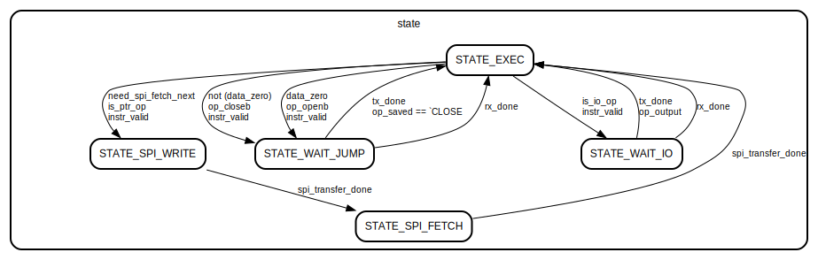

<!---

This file is used to generate your project datasheet. Please fill in the information below and delete any unused
sections.

You can also include images in this folder and reference them in the markdown. Each image must be less than
512 kb in size, and the combined size of all images must be less than 1 MB.
-->

## How it works

### Main Module


The ASIC executes Brainfuck instructions using the RP2040 for user I/O and SPI "tape". Each 3-bit instruction is decoded into data operations (+/-), pointer operations (</>), I/O operations (,/.), or bracket operations ([/]).

The design features a 9-byte data cache with SPI RAM backend for the full 1024-byte tape. When the pointer moves beyond the cached window, the ASIC writes old data to SPI and fetches new data in 5-byte bursts.

The 8-deep bracket stack supports nested loops with interrupt-driven jump handling. Bracket operations collaborate with the MCU:
- `[` with data=0: ASIC triggers `interrupt_jump` and enables RX. MCU sends PC of matching `]` via 10-bit serial.
- `[` with data≠0: ASIC pushes PC to bracket stack and continues (enter loop).
- `]` with data=0: ASIC pops bracket stack and continues (exit loop).
- `]` with data≠0: ASIC triggers `interrupt_jump` and transmits top of bracket stack via 10-bit serial TX. MCU resumes from that PC (loop back).

Two interrupt signals notify the MCU: `interrupt_jump` for bracket operations requiring PC transmission, and `interrupt_io` for user I/O. Communication between the BF ASIC and RP2040 occurs over two 2-wire serial interfaces (10-bit RX/TX for PC values and data) and SPI for the "tape" memory. The MCU monitors interrupts to handle I/O and jump requests.


### Main State machine



## How to test

- Write some BF (Like this echo loop ,\[.,\])

- Use the following encoding to translate it to what the BF_ASIC can understand:
    ```
    '-' => "000"
    '+' => "001"
    '<' => "010"
    '>' => "011"
    '[' => "100"
    ']' => "101"
    ',' => "110"
    '.' => "111"
    ```
    Heres a python script to process .b files: [link](https://github.com/map588/tt_um_brainfck_asic/blob/main/utils/bf_to_pico.py)

- Connect to the pico via UART for I/O

- `++++++++++[>+++++++>++++++++++>+++<<<-]>++.>+.+++++++..+++.>++.<<+++++++++++++++.>.+++.------.--------.>+.>++++++++++.` 
- > hello world!

## External hardware

- The TT I/O board including the RP2040 / RP2350

- RP2xx0 with [this firmware](https://github.com/MichaelBell/spi-ram-emu/) 
installed

- A protoboard, wires, and patience

Credit for SPI firmware: https://github.com/MichaelBell/spi-ram-emu