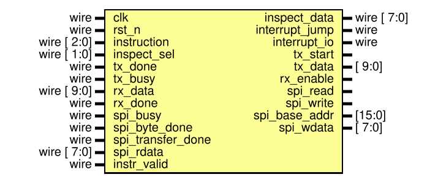
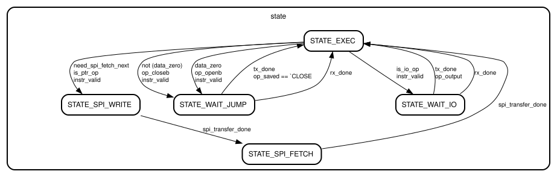

<!---

This file is used to generate your project datasheet. Please fill in the information below and delete any unused
sections.

You can also include images in this folder and reference them in the markdown. Each image must be less than
512 kb in size, and the combined size of all images must be less than 1 MB.
-->

## How it works

### Main Module



The ASIC executes Brainfuck instructions using the demo board's RP2350 for user I/O and SPI "tape". Each 3-bit instruction is decoded into data operations (+/-), pointer operations (</>), I/O operations (,/.), or bracket operations ([/]).

The design features a 9-byte data cache with SPI RAM backend for the full 1024-byte tape. When the pointer moves beyond the cached window, the ASIC writes old data to SPI and fetches new data in 5-byte bursts.

The 8-deep bracket stack supports nested loops with interrupt-driven jump handling. Bracket operations collaborate with the MCU:
- `[` with data=0: ASIC triggers `interrupt_jump` and enables RX. MCU sends PC of matching `]` via 10-bit serial.
- `[` with data≠0: ASIC pushes PC to bracket stack and continues (enter loop).
- `]` with data=0: ASIC pops bracket stack and continues (exit loop).
- `]` with data≠0: ASIC triggers `interrupt_jump` and transmits top of bracket stack via 10-bit serial TX. MCU resumes from that PC (loop back).

Two interrupt signals notify the MCU: `interrupt_jump` for bracket operations requiring PC transmission, and `interrupt_io` for user I/O. Communication between the BF ASIC and RP2350 occurs over two 2-wire serial interfaces (10-bit RX/TX for PC values and data) and SPI for the "tape" memory. The MCU monitors interrupts to handle I/O and jump requests.

Silicon status (ttsky25b): the compute core works on the fabricated chip at project clocks from 50 kHz to 2 MHz. Four interface bugs in the taped-out RTL are compensated by the host firmware. The repository README lists each bug and its workaround.


### Main State machine



## How to test

- Flash the host firmware from [firmware/](https://github.com/map588/tt_um_brainfck_asic/tree/main/firmware) onto the demo board's RP2350 and open the board's USB serial port.

- Select the design and start a clock: `design 448`, then `freq 200000` (any clock from 50 kHz to 2 MHz works).

- Start a session with `bf`, paste Brainfuck source, and end it with `!`. Anything that isn't one of the eight BF ops is ignored as a comment, and anything after the `!` is consumed as `,` input by the running program. Each session starts from a reset machine and a zeroed tape.

- Or run the TUI from [explorer/](https://github.com/map588/tt_um_brainfck_asic/tree/main/explorer): a program editor, live session status, and a single-step debugger with breakpoints.

- The firmware translates each op on the fly to the ASIC's 3-bit encoding:
    ```
    '-' => "000"
    '+' => "001"
    '<' => "010"
    '>' => "011"
    '[' => "100"
    ']' => "101"
    ',' => "110"
    '.' => "111"
    ```

- `++++++++++[>+++++++>++++++++++>+++<<<-]>++.>+.+++++++..+++.>++.<<+++++++++++++++.>.+++.------.--------.>+.>++++++++++.!` 
- > Hello World!

## External hardware

- The Tiny Tapeout demo board (RP2350) running [the host firmware](https://github.com/map588/tt_um_brainfck_asic/tree/main/firmware): one core runs the execution engine (instruction feed, I/O and bracket-jump interrupts, the tape), the other runs USB and the command protocol.